### Flowchart visualizes the architecture of the HAPI FHIR JPA Server Starter — a Spring Boot-based application designed to support FHIR REST APIs with clinical reasoning, CDS Hooks, terminology services, and implementation guides.

🎯 Purpose
- Illustrates how different Spring Boot components, feature modules, and the web layer are organized.
- Shows the data flow between the web UI, REST clients, backend services, and external dependencies (e.g., message brokers, SMTP, Elasticsearch).
- Highlights optional modules like Clinical Reasoning, MDM, and CDS Hooks.
- Depicts how the application is deployed via Docker, Docker Compose, or Helm charts on Kubernetes.
- This diagram is intended to help developers and DevOps teams understand the internal structure and deployment pathways of the HAPI FHIR JPA Server project at a glance.

```mermaid
flowchart TB
    %% Clients
    subgraph "Clients"
        direction TB
        Browser["Web Browser UI"]:::external
        RESTClient["REST Clients (FHIR API)"]:::external
        CDSExternal["External CDS Hooks Services"]:::external
    end

    %% Spring-Boot Server
    subgraph "Spring Boot Application"    
        direction TB

        subgraph "Web Layer"
            direction TB
            Application["Application.java"]:::core
            AppProps["AppProperties.java"]:::core
            JobController["JobController"]:::core
            CdsHooksServlet["CdsHooksServlet"]:::optional
            CustomContentConfig["CustomContentFilesConfigurer"]:::core
            WebAppConfig["WebAppFilesConfigurer"]:::core
            RestfulServer["RestfulServer (HAPI FHIR)"]:::core
        end

        subgraph "Feature Modules"
            direction TB
            subgraph "Common Config" 
                direction TB
                StarterJpaConfig["StarterJpaConfig.java"]:::core
                FhirServerConfigR4["FhirServerConfigR4.java"]:::core
            end
            ElasticsearchConfig["ElasticsearchConfig.java"]:::optional
            subgraph "CDS Hooks Module"
                direction TB
                CdsHooksProps["CdsHooksProperties.java"]:::optional
                StarterCdsHooksConfig["StarterCdsHooksConfig.java"]:::optional
            end
            subgraph "Clinical Reasoning Module"
                direction TB
                PostInitProvider["PostInitProviderRegisterer.java"]:::optional
                CrR4Config["StarterCrR4Config.java"]:::optional
                CrDstu3Config["StarterCrDstu3Config.java"]:::optional
            end
            subgraph "Implementation Guides Module"
                direction TB
                IGR4Provider["ImplementationGuideR4OperationProvider.java"]:::optional
                IGR5Provider["ImplementationGuideR5OperationProvider.java"]:::optional
            end
            StarterIpsConfig["StarterIpsConfig.java"]:::optional
            MdmConfig["MdmConfig.java"]:::optional
            TerminologyConfig["TerminologyConfig.java"]:::optional
            subgraph "Validation Factories"
                direction TB
                RepoValFactoryR4["RepositoryValidationInterceptorFactoryR4.java"]:::core
            end
        end

        subgraph "Persistence Layer"
            direction TB
            RDBMS["Relational DB (H2/Postgres/MS SQL)"]:::core
            ESCluster["Elasticsearch Cluster"]:::optional
            TopicCache["In-memory Topic Cache"]:::core
            ChannelFactory["Channel Factory"]:::core
        end
    end

    %% External Services
    subgraph "External Services"
        direction TB
        SMTP["SMTP Server"]:::external
        RESTHookExt["External RESTHook Endpoints"]:::external
        MsgBroker["Message Broker"]:::external
        K8sAPI["Kubernetes API"]:::external
        DockerRegistry["Docker Registry"]:::external
    end

    %% Data Flows
    Browser -->|HTTP/8080| RestfulServer
    RESTClient -->|FHIR REST Call| RestfulServer
    RestfulServer -->|invokes| StarterJpaConfig
    RestfulServer -->|invokes| FhirServerConfigR4
    RestfulServer -->|uses| RepoValFactoryR4
    RestfulServer -->|handles| CdsHooksServlet
    CdsHooksServlet -->|reads| CdsHooksProps
    CdsHooksServlet -->|invokes| StarterCdsHooksConfig
    PostInitProvider -->|registers| RestfulServer
    RestfulServer -->|JPA Save/Query| RDBMS
    RDBMS -->|events| ElasticsearchConfig
    ElasticsearchConfig -.->|indexes| ESCluster
    RestfulServer -->|onResourceChange| TopicCache
    TopicCache -->|publishes| ChannelFactory
    ChannelFactory -->|notifies| Browser
    ChannelFactory -->|emails| SMTP
    CdsHooksServlet -->|outbound RESTHook| RESTHookExt
    TopicCache -->|MDM Trigger| MdmConfig
    MdmConfig -->|writes| RDBMS

    %% Deployment Artifacts
    Dockerfile["Dockerfile"]:::external
    Compose["docker-compose.yml"]:::external
    HelmChart["charts/hapi-fhir-jpaserver/"]:::external
    Browser -->|pull image| Dockerfile
    Dockerfile -->|runs| SpringBootApplication
    HelmChart -->|deploys| SpringBootApplication
    K8sAPI -->|manages| HelmChart
    Compose -->|spins up| SpringBootApplication
    Compose -->|spins up| RDBMS

    %% Styles
    classDef core fill:#D0E6FF,stroke:#0366d6,color:#0366d6
    classDef optional fill:#E6FFEA,stroke:#22863A,color:#22863A,stroke-dasharray: 5 5
    classDef external fill:#FFF5E6,stroke:#D9822B,color:#D9822B
```

